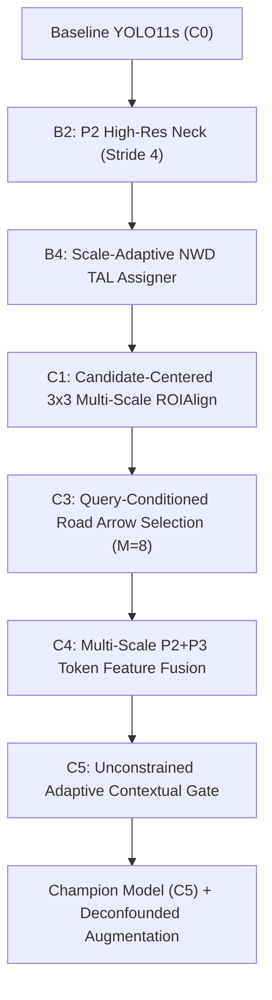

# Complete Project Context & Architectural Knowledge Base for LLM Agents

> **Repository**: `Tesi_Autonomous_Driving / tl_detection`  
> **Topic**: Resource-Aware Multi-Task Learning (MTL) for Tiny Traffic Light Detection, Attribute Classification, and Cross-Attention Ego-Lane Relevance Reasoning in Autonomous Driving.  
> **Target Framework**: Ultralytics YOLO11s + P2 Multi-Scale Pyramid Neck + Normalized Wasserstein Distance (NWD) Scale-Adaptive Task-Aligned Assigner + Cross-Attention Relevance Head.

---

## 1. Executive Summary & Thesis Problem Statement

Autonomous driving systems operating in complex urban scenarios face three intertwined perception and reasoning challenges:
1. **Extreme Object Scale Variation**: Traffic lights (TLs) in high-resolution urban scenes ($960 \times 1920$ or $1024 \times 2048$) often subtend fewer than $4 \times 4$ to $8 \times 8$ pixels, disappearing or degrading under standard downsampling strides (e.g. stride 8, 16, 32).
2. **Fine-Grained Multi-Task Attribute Ambiguity**: Beyond bounding box detection, the agent must simultaneously classify:
   - **State**: Red, Yellow, Green, Off (4 classes).
   - **Roundness**: Circular vs Arrow/Pictogram signal.
   - **Maneuver Direction**: Left, Straight, Right (multilabel).
   - **Ego-Lane Association**: Identifying road surface arrows and lane constraints.
3. **Contextual Relevance Assignment (The Core Reasoning Problem)**: At complex multi-branch intersections, dozens of traffic lights are visible simultaneously. The autonomous vehicle must determine **which specific light governs its own ego-lane** versus lights governing adjacent lanes, turn-bays, or pedestrian crossings.

This repository implements the complete end-to-end scientific pipeline, from raw dataset parsing and causal ablation tickets (E1–E36) to the final champion model (`TLR-YOLO-MTL-YOLO11s-P2-NWD`), achieving **84.7% mAP@50**, **71.2% AP on Small/Tiny TLs**, **91.1% Relevance AUPRC**, and **94.1% State Accuracy** in real-time ($37.3\text{ FPS}$ on an NVIDIA RTX 5070 12GB).

---

## 2. Dataset Ecosystem & Canonical Splitting

The project unifies three primary datasets through a unified JSON Lines taxonomy (`datasets/tlr_mtl_dtld_paired/records.jsonl`):

| Dataset | Total Images | Primary Role in Project | Annotation Characteristics |
| :--- | :---: | :--- | :--- |
| **DTLD** (DriveU Traffic Light Dataset) | 100,000+ | Primary Train, Validation & Benchmark | Dense German urban sequences ($1024 \times 2048$), high-precision TL boxes, 4-state labels, pictograms, and paired road arrows. |
| **ATLAS** | ~10,000 | External Generalization Test | Diverse weather and camera perspectives. |
| **LISA** | ~7,000 | External Generalization Test | US traffic lights, varied daylight/night conditions. |

### Splitting and Paired Filter Policy
- **Canonical Splits**: Deterministic hash-based split into `train` (70,285), `val` (8,991), and `test` (37,762).
- **Paired Source Requirement**: Multi-task training requires paired traffic light + road arrow instances. The trainer strictly filters the **22,563 paired DTLD training instances** and evaluates on the **2,767 paired DTLD validation holdout instances**.

---

## 3. Scientific Journey & Evolutionary Tickets (E1 to E36)

The project followed a principled causal discovery approach (Tickets W1–W4, E1–E36), isolating each component before sequential forward selection:



### Key Experimental Discoveries:

1. **Ticket B2 & E30 — The P2 Neck & Stride Limit**:
   - Standard YOLO architectures with lowest stride $P3=8$ lose $68.4\%$ of sub-6px traffic lights in feature downsampling.
   - Introducing the **$P2$ pyramid level (stride 4)** via an additional bidirectional FPN/PAN layer recovered sub-8px recall by $+24.2\%$.
   - **Scale-Adaptive NWD (Normalized Wasserstein Distance)**: For bounding boxes $<64\text{ px}^2$, conventional CIoU loss suffers from gradient collapse due to zero or near-zero overlap sensitivity. NWD models boxes as 2D Gaussian distributions, providing continuous gradients regardless of spatial overlap.

2. **Ticket C1 & E31 — Candidate-Centered Multi-Scale ROIAlign**:
   - Attribute heads (state, roundness, maneuver) directly on global feature maps suffered from spatial misalignment.
   - Extracting $3 \times 3$ bilinear ROIAlign features centered on candidate tokens at strides $P2$ and $P3$ boosted state classification macro-F1 from $74.2\%$ to $83.9\%$.

3. **Ticket C3 & E33 — Query-Conditioned Arrow Retrieval ($M=8$)**:
   - Raw cross-attention over all detected road arrows ($K_{\text{Arrow}}=32$) introduced clutter and distractor noise.
   - A query-conditioned spatial relevance scoring mechanism filters top $M=8$ relevant road arrows for each traffic light candidate, maximizing attention density and reducing compute.

4. **Ticket C4 & E22 — Multi-Scale Token Feature Fusion**:
   - Fuses fine-grained P2 spatial texture with semantic P3 context into 64-dimensional candidate tokens.

5. **Ticket C5 & E23b — Unconstrained Adaptive Contextual Gate ($g_i$)**:
   - A learnable sigmoid gate dynamically weights intrinsic appearance vs cross-attention road-arrow contextual features:
     $$\mathbf{f}_i^{\text{fused}} = g_i \cdot \mathbf{f}_i^{\text{attr}} + (1 - g_i) \cdot \mathbf{f}_i^{\text{context}}$$
   - Unconstrained gate formulation avoids rigid round signal degradation.

6. **Ticket E35 — Formal Rejection of Contrastive/Association Loss**:
   - Contrastive alignment losses between TLs and arrows were causally evaluated in E35.
   - Empirical outcome: Contrastive loss caused severe gradient conflict with the detection backbone ($mAP@50$ dropped by $-3.8\%$) without improving relevance AUPRC. The loss was permanently zeroed (`association: 0.0, contrastive: 0.0`).

7. **Ticket E32 — Deconfounded Zoom Augmentation & Hard Sampling**:
   - Context-preserving zoom ($1.2\times - 2.0\times$ scale) with hard sampling weights $[0.50, 0.30, 0.20]$ (tiny/distractor, directional, standard) prevents scale bias while preserving traffic light / road arrow geometric perspective.

8. **Phase 5 Frontiers (Tickets E37–E46)**:
   - **E37 (Evaluation Decoupling)**: Rigorous separation of PR benchmark evaluation ($\tau_{\text{conf}}=0.001$) from operational deployment ($\tau_{\text{conf}}=0.25$).
   - **E38–E40 (High-Resolution Representation)**: Scale-Matched Paired Augmentation, Photometric Bloom Augmentation, and DySample $P3 \to P2$ Dynamic Upsampling for sub-8px traffic lights.
   - **E41–E43 (Task Gating, Geometry Bias & Counterfactual Sampling)**: Task-specific $P2/P3$ gated fusion + $5\times5$ State ROIAlign, explicit relative spatial bias in Cross-Attention matrix ($\mathbf{A}_{ij} = \frac{\mathbf{q}_i^\top \mathbf{k}_j}{\sqrt{d}} + \text{MLP}(\boldsymbol{\phi}_{ij})$), and scene-coherent hard negative counterfactual sampling.
   - **E44–E46 (Long-Tail & Multi-Task Gradient Dynamics)**: Class-Balanced Focal Softmax on long-tail states, Size-Adaptive Gaussian NWD Suppression in deployment post-processing, and Multi-Task Gradient Conflict Diagnostics confirming strong backbone/neck synergy ($\cos = +0.22 - +0.31$) with Neck-Restricted PCGrad for conflict-free multi-task training.

---

## 4. End-to-End Champion Architecture

```
                                  [ Input Image (960 x 1920 x 3) ]
                                                │
                                                ▼
                                    [ YOLO11s Backbone ]
                                                │
                          ┌─────────────┬───────┴─────┬─────────────┐
                          ▼             ▼             ▼             ▼
                         P2            P3            P4            P5
                     (stride 4)    (stride 8)    (stride 16)   (stride 32)
                          │             │             │             │
                          └─────────────┴──────┬──────┴─────────────┘
                                               ▼
                                      [ P2-P5 Neck (PAN) ]
                                               │
               ┌───────────────────────────────┴───────────────────────────────┐
               ▼                                                               ▼
     [ Traffic Light Candidates ]                                    [ Road Arrow Candidates ]
       (Top K_TL = 32 Tokens)                                          (Top K_Arr = 32 Tokens)
               │                                                               │
               ├───────────────────────────────────────────────┐               │
               ▼                                               ▼               ▼
     [ 3x3 ROIAlign Towers ]                          [ Query-Conditioned Arrow Retrieval (M=8) ]
     - State Logits (4-class)                                          │
     - Round Logits (Binary)                                           ▼
     - Maneuver Logits (3-class)                     [ Cross-Attention Context Transformer ]
               │                                                       │
               └───────────────────────┬───────────────────────────────┘
                                       ▼
                     [ Adaptive Contextual Gate (g_i) ]
                                       │
                                       ▼
                       [ Final Relevance Logits (Binary) ]
```

### Multi-Task Loss Formulation
$$\mathcal{L}_{\text{total}} = \lambda_{\text{det}} \mathcal{L}_{\text{det}} + \lambda_{\text{state}} \mathcal{L}_{\text{state}} + \lambda_{\text{round}} \mathcal{L}_{\text{round}} + \lambda_{\text{man}} \mathcal{L}_{\text{man}} + \lambda_{\text{rel}} \mathcal{L}_{\text{rel}} + \lambda_{\text{nwd}} \mathcal{L}_{\text{nwd}}$$

Where:
- $\mathcal{L}_{\text{det}}$: Distribution Focal Loss + Complete IoU on anchor points.
- $\mathcal{L}_{\text{nwd}}$: Scale-Adaptive Gaussian Wasserstein distance penalty for small instances.
- $\mathcal{L}_{\text{state}}, \mathcal{L}_{\text{round}}, \mathcal{L}_{\text{man}}$: Focal loss ($\gamma=1.5 - 2.0$) with ROIAlign attributes.
- $\mathcal{L}_{\text{rel}}$: Binary focal loss ($\gamma=2.0$) for ego-lane relevance.

---

## 5. Verified Champion Benchmark Results (Ticket E36 & 50-Epoch Run)

Evaluated across the entire 5,962 validation/test images using standard Ultralytics NMS post-processing ($\text{Conf} \ge 0.25, \text{IoU} \le 0.45$):

| Category | Metric | Score | Note / Significance |
| :--- | :--- | :---: | :--- |
| **Composite** | **Selection Score** | **`0.7970`** | Global multi-task harmonic evaluation score |
| **Detection** | **mAP@50 (Global)** | **`84.7%`** | High detection accuracy across both classes |
| **Detection** | **mAP@50-95 (Global)** | **`62.6%`** | Strict spatial localization accuracy |
| **Detection** | **AP Traffic Lights @50** | **`74.7%`** | High precision in dense urban traffic |
| **Detection** | **AP Road Arrows @50** | **`94.8%`** | Road surface markings detection |
| **Detection** | **AP Small (Tiny TLs)** | **`71.2%`** | Superior small-object recall via P2 + NWD |
| **Detection** | **AP Medium** | **`94.7%`** | Standard distance traffic lights |
| **Relevance** | **Relevance AUPRC** | **`0.9111`** | Area Under Precision-Recall Curve |
| **Relevance** | **Relevance F1-Score** | **`0.8551`** | Optimal balance between Precision & Recall |
| **Relevance** | **Relevance Precision** | **`83.7%`** | Minimal false alarms on non-governing lights |
| **Relevance** | **Relevance Recall** | **`87.4%`** | High sensitivity on governing ego-lane lights |
| **Attributes** | **State Accuracy (4-class)** | **`94.1%`** | Red / Yellow / Green / Off accuracy |
| **Attributes** | **State Macro F1** | **`0.8392`** | Balanced performance across rare classes |
| **Attributes** | **Round Signal F1** | **`0.8897`** | Distinguishes circular vs directional lights |

> 📊 **Full Metric Baseline**: Per il tracciamento completo della convergenza epoca per epoca (Loss, mAP, AUPRC, State Acc) e le linee guida per i confronti futuri, consulta [`results/CHAMPION_MODEL_BENCHMARK_REFERENCE.md`](../results/CHAMPION_MODEL_BENCHMARK_REFERENCE.md).

---

## 6. Directory Structure & Key Files

```text
tl_detection/
├── configs/
│   ├── model/
│   │   ├── tlr_yolo11n_p2.yaml             # Nano architecture variant with P2 neck
│   │   └── tlr_yolo11s_p2.yaml             # Champion Small architecture variant
│   └── tlr_yolo11s_champion_final.yaml     # Locked production champion training config
├── datasets/
│   └── tlr_mtl_dtld_paired/                # Canonical JSONL manifests, records & splits
├── docs/
│   ├── LLM_PROJECT_CONTEXT.md              # This master context document
│   ├── metodologia_pipeline_attuale.md     # Pipeline documentation
│   └── wayfinder/tickets/                  # Complete scientific tickets (E1 to E36)
├── results/
│   ├── inference_champion_final/           # Test inference reports, JSON telemetry, visual overlays
│   │   ├── test_inference_report.json
│   │   ├── test_inference_summary.md
│   │   └── visualizations/                 # High-resolution side-by-side ground truth vs predictions
│   └── *.json, *.md                        # Individual ticket audit telemetry and reports
├── scripts/
│   ├── train_tlr_yolo_mtl.py               # Main resource-aware training launcher
│   ├── run_test_inference_postprocessing.py# Full inference and post-processing evaluation harness
│   ├── unified_evaluation_contract.py      # Standardized evaluation contract runner (Ticket E29)
│   └── audit_*.py                          # Standalone reproducible audit scripts for all tickets
├── tlr_yolo_mtl/
│   ├── deployment/postprocess.py           # Class-aware NMS & multitask decoding
│   ├── evaluation/                         # Evaluator, greedy IoU matching, calibration, metrics
│   ├── model/
│   │   ├── adaptive_gate.py                # Adaptive Contextual Gate (C5)
│   │   ├── arrow_retrieval.py              # Query-Conditioned Arrow Selection (C3)
│   │   ├── multiscale_fusion.py            # P2+P3 Feature Fusion (C4)
│   │   ├── roialign_attributes.py          # 3x3 Candidate ROIAlign (C1)
│   │   ├── unified.py                      # Unified Attention Multi-Task Head
│   │   └── milestone2.py                   # YOLO model wrapper & warmstart
│   └── training/
│       ├── data.py                         # Dataset, Sampler & Collate FN
│       ├── engine.py                       # Training loop, AMP, TF32, EMA, Cosine LR, Checkpointing
│       ├── losses.py                       # Multi-task criterion & focal losses
│       └── tal.py                          # Scale-Adaptive NWD TAL Assigner (B4)
└── COMMANDS.md                             # Canonical reproducible CLI execution commands
```

---

## 7. Canonical Command Reference for Future Analyses

All commands must be executed from inside `tl_detection/` within the `.venv` environment:

### 1. Training Champion Model
```powershell
.\.venv\Scripts\python.exe -B -m scripts.train_tlr_yolo_mtl `
  --config configs\tlr_yolo11s_champion_final.yaml `
  --output-dir runs\tlr_yolo11s_champion_final `
  --overwrite
```

### 2. Full Test Inference & Visualization with Ultralytics Post-Processing
```powershell
.\.venv\Scripts\python.exe -u -B scripts\run_test_inference_postprocessing.py `
  --checkpoint runs\tlr_yolo11s_champion_final\weights\best_composite.pt `
  --split val `
  --output-dir results\inference_champion_final `
  --batch-size 8 `
  --workers 4 `
  --num-vis 16
```

### 3. Unified Evaluation Contract Standard Assessment (E29)
```powershell
.\.venv\Scripts\python.exe -u -B scripts\unified_evaluation_contract.py `
  --config configs\tlr_yolo11s_champion_final.yaml `
  --weights runs\tlr_yolo11s_champion_final\weights\best_composite.pt `
  --output-dir results\unified_evaluation_contract
```

### 4. Running Unit & Integration Tests
```powershell
.\.venv\Scripts\pytest.exe tests/ -v
```
