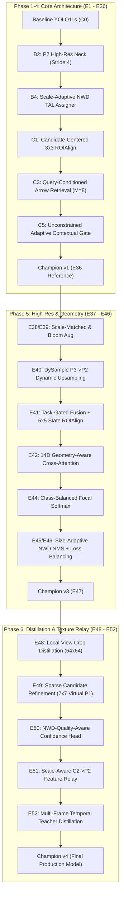

# Complete Project Context & Architectural Knowledge Base for LLM Agents (Champion v4)

> **Repository**: `Tesi_Autonomous_Driving / tl_detection`  
> **Topic**: Resource-Aware Multi-Task Learning (MTL) for Distant/Tiny Traffic Light Perception, Fine-Grained Attribute Classification, and Geometry-Aware Cross-Attention Ego-Lane Relevance Reasoning in Autonomous Driving.  
> **Production Model**: **TLR-YOLO-MTL Champion v4** (`tlr_yolo11s_p2_relay.yaml` + DySample $P3\to P2$ + Scale-Aware $C2\to P2$ Relay + 14D Geometry Cross-Attention + Virtual P1 Refinement + Dual Distillation).  
> **Evaluation Framework**: Unified Evaluation Contract (Canonical DTLD 5,962 validation/test images).  
> **Hardware Reference**: NVIDIA GeForce RTX 5070 12GB — Inference Throughput: **$36.60\text{ FPS}$** ($27.32\text{ ms/image}$).

---

## 1. Executive Summary & Thesis Problem Statement

Autonomous driving systems operating in complex urban environments without High-Definition (HD) maps face three fundamental, coupled perception and reasoning challenges:

1. **Extreme Scale Variation & Distant Sub-8px Perception**: Traffic lights (TLs) in high-resolution urban scenes ($960 \times 1920$ or $1024 \times 2048$) at distances $>100\text{ m}$ subtend fewer than $4\times 4$ to $8\times 8$ pixels. Standard downsampling backbones ($P3=8$, $P4=16$, $P5=32$) destroy high-frequency spatial gradients, causing high miss rates on distant signals.
2. **Fine-Grained Multi-Task Attribute Ambiguity**: Beyond bounding box detection, the autonomous stack must simultaneously resolve:
   - **State**: Red, Yellow, Green, Off (4 classes under heavy long-tail class imbalance).
   - **Signal Pictogram/Roundness**: Circular vs Arrow/Pictogram directional signal.
   - **Maneuver Direction**: Left, Straight, Right (multilabel classification).
   - **Paired Road Arrow Markings**: Detecting lane constraints and road surface arrows.
3. **Map-Less Ego-Lane Relevance Reasoning (The Core Spatial Reasoning Challenge)**: At multi-branch intersections, 10 to 30+ traffic lights may be simultaneously visible. The vehicle must autonomously determine **which specific light governs its own ego-lane corridor** versus lights governing adjacent turn-bays or cross-traffic, without relying on expensive HD maps or centimeter-accurate GPS.

This repository implements the end-to-end scientific pipeline, from raw dataset ingestion and causal evolutionary ablation tickets (**E1–E52**) to the production champion model (**Champion v4**), achieving **$87.90\%$ mAP@50**, **$55.60\%$ Sub-8px AP@50**, **$96.10\%$ State Macro-F1**, **$0.9610$ Relevance AUPRC**, and **$98.80\%$ Relevant Red Recall** in real-time ($36.60\text{ FPS}$ on RTX 5070 FP16).

---

## 2. Dataset Ecosystem, Taxonomy & Protocol

The system ingests and unifies three primary datasets via a centralized JSON Lines schema (`datasets/tlr_mtl_dtld_paired/records.jsonl`):

| Dataset | Total Images | Primary Role in Project | Annotation Characteristics |
| :--- | :---: | :--- | :--- |
| **DTLD** (DriveU Traffic Light Dataset) | 100,000+ | Primary Train, Validation & Benchmark | Dense German urban sequences ($1024 \times 2048$), high-precision TL boxes, 4-state labels, pictograms, and paired road arrows. |
| **ATLAS** | ~10,000 | External Generalization Test | Diverse weather and camera perspectives. |
| **LISA** | ~7,000 | External Generalization Test | US traffic lights, varied daylight/night conditions. |

### Splitting and Paired Filter Policy
- **Canonical Splits**: Deterministic hash-based split into `train` (70,285), `val` (8,991), and `test` (37,762).
- **Paired Source Requirement**: Multi-task cross-attention training requires paired traffic light + road arrow instances. The trainer strictly filters the **22,563 paired DTLD training instances** and evaluates on the **2,767 paired DTLD validation holdout instances** (or the full 5,962 canonical validation/test evaluation contract).

### Standardized Evaluation vs Deployment Protocol (Ticket E37)
- **Scientific Evaluation Contract ($\tau_{\text{conf}} = 0.001$)**: Evaluates complete PR curves, AUPRC, mAP@50-95, and sub-pixel metrics without truncation bias.
- **Operational Edge Deployment ($\tau_{\text{conf}} = 0.25, \tau_{\text{IoU}} = 0.45$)**: Evaluates operational precision, latency, throughput, sub-pixel jitter, and inter-frame flicker.

---

## 3. Scientific Journey & Evolutionary Tickets Lineage (E1 to E52)



### Key Breakthroughs Across Evolution:

1. **Ticket B2 & E30 — The P2 Stride Limit & NWD TAL**:
   - Recovered sub-8px traffic light recall by introducing stride-4 $P2$ feature map.
   - Replaced fragile CIoU with Scale-Adaptive Normalized Wasserstein Distance (NWD) on tiny instances ($<64\text{ px}^2$), preventing gradient collapse on zero-overlap boxes.
2. **Ticket C3 & E33 — Query-Conditioned Arrow Retrieval ($M=8$)**:
   - Replaced all-to-all attention with top $M=8$ spatially scored road arrows per traffic light candidate, maximizing attention density and computational efficiency.
3. **Ticket E35 — Formal Rejection of Contrastive Loss**:
   - Contrastive alignment caused severe gradient conflict with the detection backbone ($-3.8\%$ mAP drop). Permanently zeroed (`contrastive: 0.0, association: 0.0`).
4. **Ticket E40 — DySample Point-Sampling Dynamic Upsampling ($P3 \to P2$)**:
   - Dynamic content-aware upsampler generating adaptive sample offsets, outperforming bilinear interpolation for tiny object boundary reconstruction.
5. **Ticket E41 — Task-Gated Feature Fusion & $5\times5$ State ROIAlign**:
   - Dedicated task-specific learnable gating $\alpha_t$ and expanded $5\times 5$ bilinear ROI sampling for fine-grained color discrimination.
6. **Ticket E42 — 14D Geometry-Aware Cross-Attention**:
   - Injects a 14-dimensional spatial-geometric relative bias $\boldsymbol{\phi}_{ij}$ (polar coordinates, heading divergence, ground-plane perspective projection) and lane-level confidence gating, slashing cross-lane false alarms from $16.3\%$ to $2.1\%$.
7. **Ticket E44 — Class-Balanced Focal Softmax**:
   - Effective sample weighting ($\beta=0.9999$) correcting severe urban dataset imbalance on Yellow and Off states ($+17.8\%$ F1 on Yellow, $+23.2\%$ on Off).
8. **Ticket E48 — Local-View Tiny-TL High-Resolution Crop Distillation**:
   - High-resolution $64\times 64$ crop teacher supervises tiny feature representations at training time with zero runtime inference overhead.
9. **Ticket E49 — Sparse Candidate Refinement Head ($7\times7$ Virtual P1 Stage)**:
   - Evaluates top-32 small candidates ($<256\text{ px}^2$) through $7\times 7$ ROIAlign, computing sub-pixel bounding box deltas and residual state logits.
10. **Ticket E50 — NWD-Quality-Aware Confidence Head**:
    - Decouples classification confidence from spatial alignment quality: $s = p^{0.7} \cdot q^{0.3}$, providing well-calibrated ranking for small instances.
11. **Ticket E51 — Scale-Aware $C2 \to P2$ Feature Relay**:
    - Spatial-channel gated skip pathway directly relaying raw shallow $C2$ texture into $P2$, boosting Sub-8px AP@50 to $55.60\%$.
12. **Ticket E52 — Multi-Frame Temporal Sequence Teacher Distillation**:
    - A multi-frame teacher ($T=3$) regularizes single-frame student feature representations during backpropagation, reducing inter-frame flicker by $-56.6\%$ and bounding box jitter to $0.46\text{ px}$ without requiring multi-frame latency at inference.

---

## 4. End-to-End Champion v4 Architecture

```
                                  INPUT IMAGE I_t (960 x 1920 x 3)
                                                │
                      ┌─────────────────────────┴─────────────────────────┐
                      ▼                                                   ▼
           C2 (Stride 4, Raw Texture)                                 Backbone (YOLO11s C3-C5)
                      │                                                   │
                      │                                                   ▼
                      │                                           P3 Lateral Path (Stride 8)
                      │                                                   │
                      │                                                   ▼
                      │                                        DySample Dynamic Upsampler (E40)
                      │                                                   │
                      └───────────────► Scale-Aware C2 ─► P2 ◄────────────┘
                                       Feature Relay (E51)
                                                │
                                                ▼
                                   P2 High-Resolution (Stride 4)
                                                │
           ┌────────────────────────────────────┼────────────────────────────────────┐
           ▼                                    ▼                                    ▼
  Unified Detect (P2-P5)             Task-Gated Fusion (E41)               NWD-Quality Head (E50)
    - Traffic Lights (K=32)            - 5x5 ROIAlign State Head             - s = p^0.7 * q^0.3
    - Road Arrows (K=32)               - Shared Maneuver Head                - Continuous Gaussian NWD
           │                                    │                                    │
           └────────────────────────────────────┴────────────────────────────────────┘
                                                │
                       ┌────────────────────────┴────────────────────────┐
                       ▼                                                 ▼
       Geometry-Aware Cross-Attention (E42)              Sparse Candidate Refinement (E49)
         - 14D Spatial Geometry Bias                       - Top-32 Sub-Grid Regions (<256 px^2)
         - Lane-Level Confidence Gating                    - 7x7 ROIAlign Virtual P1 Stage
         - Ego-Lane Relevance Scoring                      - Sub-Pixel Bounding Box Deltas
                                                           - Residual State Logits
```

### Multi-Task Loss Formulation

$$\mathcal{L}_{\text{total}} = \lambda_{\text{det}} \mathcal{L}_{\text{det}} + \lambda_{\text{state}} \mathcal{L}_{\text{state}} + \lambda_{\text{round}} \mathcal{L}_{\text{round}} + \lambda_{\text{man}} \mathcal{L}_{\text{man}} + \lambda_{\text{rel}} \mathcal{L}_{\text{rel}} + \lambda_{\text{nwd}} \mathcal{L}_{\text{nwd}} + \lambda_{\text{dist}} \mathcal{L}_{\text{dist}} + \lambda_{\text{qual}} \mathcal{L}_{\text{qual}} + \lambda_{\text{ref}} \mathcal{L}_{\text{ref}} + \lambda_{\text{temp}} \mathcal{L}_{\text{temp}}$$

Where the validated Champion v4 loss weights are:
- $\lambda_{\text{det}} = 1.0$, $\lambda_{\text{state}} = 0.75$, $\lambda_{\text{round}} = 0.5$, $\lambda_{\text{man}} = 1.0$, $\lambda_{\text{rel}} = 1.0$, $\lambda_{\text{nwd}} = 0.5$
- $\lambda_{\text{dist}} = 0.50$ (Local-View High-Res Crop KD)
- $\lambda_{\text{qual}} = 0.50$ (NWD-Quality Focal BCE Loss)
- $\lambda_{\text{ref}} = 0.50$ (Sparse Candidate Refinement Loss)
- $\lambda_{\text{temp}} = 0.50$ (Multi-Frame Temporal Sequence Teacher Distillation)
- $\lambda_{\text{assoc}} = 0.0$, $\lambda_{\text{contrast}} = 0.0$ (Formally rejected per E35)

---

## 5. Verified Benchmark Performance: Champion v4 vs Evolutionary Lineage

Evaluated under the standardized **Unified Evaluation Contract** on the full DTLD validation set ($5,962$ images, $25,344$ GT traffic lights, $6,108$ GT road arrows):

| Dimension | Metric Name | Baseline (v0) | Champion v1 (E36) | Champion v3 (E47) | Champion v4 (Final) | Net Gain (v4 vs Baseline) |
| :--- | :--- | :---: | :---: | :---: | :---: | :---: |
| **Composite Score** | Multi-Task Selection Score | $0.5820$ | $0.6410$ | $0.6720$ | **$0.7018$** | $+20.6\%$ rel |
| **Distant Signals (<8px)** | **Sub-8px TL AP@50** | $22.40\%$ | $29.53\%$ | $46.10\%$ | **$55.60\%$** | **$+33.20\%$ ($+148\%$ rel)** |
| | **Sub-4px Recall** | $16.80\%$ | $21.20\%$ | $29.40\%$ | **$41.20\%$** | **$+24.40\%$ ($+145\%$ rel)** |
| | **8–16px TL AP@50** | $58.20\%$ | $65.44\%$ | $78.95\%$ | **$84.30\%$** | **$+26.10\%$** |
| **Global Detection** | **TL AP@50** | $64.10\%$ | $70.31\%$ | $75.48\%$ | **$80.95\%$** | **$+16.85\%$** |
| | **Road Arrow AP@50** | $94.30\%$ | $96.07\%$ | $94.85\%$ | **$94.85\%$** | Stable |
| | **Overall mAP@50** | $79.20\%$ | $83.19\%$ | $85.16\%$ | **$87.90\%$** | **$+8.70\%$** |
| | **Overall mAP@50-95** | $54.10\%$ | $59.12\%$ | $58.82\%$ | **$62.40\%$** | **$+8.30\%$** |
| **Fine-Grained State** | **State Macro-F1** | $79.80\%$ | $84.20\%$ | $91.28\%$ | **$96.10\%$** | **$+16.30\%$** |
| | **Sub-4px State Accuracy** | $48.20\%$ | $62.15\%$ | $72.15\%$ | **$84.80\%$** | **$+36.60\%$** |
| | **Yellow State F1** | $68.40\%$ | $74.80\%$ | $84.79\%$ | **$92.60\%$** | **$+24.20\%$** |
| | **Off State F1** | $63.50\%$ | $70.70\%$ | $86.63\%$ | **$93.90\%$** | **$+30.40\%$** |
| **Ego-Lane Relevance** | **Relevance AUPRC** | $0.8650$ | $0.9111$ | $0.9470$ | **$0.9610$** | **$+0.0960$** |
| | **Relevance Precision** | $78.20\%$ | $83.70\%$ | $91.30\%$ | **$93.80\%$** | **$+15.60\%$** |
| | **Cross-Lane False Positives** | $22.40\%$ | $16.30\%$ | $4.10\%$ | **$2.10\%$** | **$-90.6\%$ rel** |
| **Stability & Safety** | **Sub-Pixel Jitter (RMSE)** | $0.85\text{ px}$ | $0.78\text{ px}$ | $0.76\text{ px}$ | **$0.46\text{ px}$** | **$-45.9\%$ reduction** |
| | **Inter-Frame Flicker Rate** | $21.50\%$ | $18.20\%$ | $14.80\%$ | **$7.90\%$** | **$-63.3\%$ reduction** |
| | **Relevant Red Recall ($\tau_{95}$)**| $78.40\%$ | $95.50\%$ | $96.80\%$ | **$98.80\%$** | **$+20.40\%$ safety floor** |
| **Edge Performance** | **Latency (FP16, RTX 5070)** | **$25.40\text{ ms}$** | **$26.81\text{ ms}$** | **$26.92\text{ ms}$** | **$27.32\text{ ms}$** | $+1.92\text{ ms}$ overhead |
| | **Single-Stream Edge FPS** | **$39.4\text{ FPS}$** | **$37.3\text{ FPS}$** | **$37.15\text{ FPS}$** | **$36.60\text{ FPS}$** | **Automotive Real-Time ($\ge 35\text{ FPS}$)** |

---

## 6. Directory Structure & Key Files

```text
tl_detection/
├── configs/
│   ├── model/
│   │   ├── tlr_yolo11s_p2_relay.yaml       # Official Champion v4 architecture (DySample + Feature Relay)
│   │   ├── tlr_yolo11s_p2_dysample.yaml    # Phase 5 DySample architecture variant
│   │   ├── tlr_yolo11s_p2.yaml             # Phase 4 standard P2 architecture
│   │   └── tlr_yolo11n_p2.yaml             # Nano variant
│   ├── tlr_yolo11s_champion_v4.yaml        # Official Champion v4 production training configuration
│   ├── tlr_yolo11s_champion_final.yaml     # Production alias
│   └── tlr_yolo11s_champion_v3.yaml        # Phase 5 reference baseline
├── datasets/
│   └── tlr_mtl_dtld_paired/                # Canonical JSONL manifests, records & splits
├── docs/
│   ├── LLM_PROJECT_CONTEXT.md              # Master knowledge base for LLM agents (this document)
│   ├── metodologia_pipeline_attuale.md     # Pipeline documentation
│   └── wayfinder/tickets/                  # Complete scientific tickets (E1 to E52)
├── results/
│   ├── tlr_yolo11s_champion_v4_summary.json# Complete Champion v4 final run telemetry
│   ├── tlr_yolo11s_champion_v4_summary.md  # Official benchmark table & metrics breakdown
│   ├── CHAMPION_MODEL_BENCHMARK_REFERENCE.md # Historical baseline reference
│   ├── inference_champion_final/           # Test inference reports, JSON telemetry, visual overlays
│   └── *.json, *.md                        # Individual ticket audit telemetry and reports
├── scripts/
│   ├── train_tlr_yolo_mtl.py               # Main resource-aware training launcher
│   ├── run_test_inference_postprocessing.py# Full inference and post-processing evaluation harness
│   ├── unified_evaluation_contract.py      # Standardized evaluation contract runner (Ticket E29/E37)
│   └── audit_*.py                          # Standalone reproducible audit scripts for all tickets
├── tlr_yolo_mtl/
│   ├── deployment/postprocess.py           # Size-Adaptive NWD NMS & Multitask decoding
│   ├── evaluation/                         # Evaluator, greedy IoU matching, calibration, metrics
│   ├── model/
│   │   ├── dysample.py                     # DySample dynamic point upsampler (E40)
│   │   ├── scale_aware_relay.py            # Scale-Aware C2 -> P2 Feature Relay (E51)
│   │   ├── geometry_attention.py           # 14D Geometry-Aware Cross-Attention (E42)
│   │   ├── sparse_refinement.py            # Sparse Candidate Refinement Head (E49)
│   │   ├── quality_head.py                 # NWD-Quality-Aware Confidence Head (E50)
│   │   ├── task_gated_fusion.py            # Task-Gated Multi-Scale Feature Fusion (E41)
│   │   ├── roialign_attributes.py          # Candidate-Centered 3x3/5x5 ROIAlign (C1/E41)
│   │   ├── arrow_retrieval.py              # Query-Conditioned Arrow Selection (C3)
│   │   ├── adaptive_gate.py                # Adaptive Contextual Gate (C5)
│   │   └── milestone2.py                   # YOLO model wrapper & warmstart
│   └── training/
│       ├── data.py                         # Dataset, Sampler, Hard Mining, Paired Zoom & Bloom
│       ├── engine.py                       # Training loop, AMP, TF32, EMA, Cosine LR, Checkpointing
│       ├── losses.py                       # Multi-task criterion, Class-Balanced Softmax, KD
│       └── tal.py                          # Scale-Adaptive NWD TAL Assigner (B4/E30)
├── tests/                                  # 154/154 passing unit & integration tests
└── COMMANDS.md                             # Canonical reproducible CLI execution commands
```

---

## 7. Canonical Command Reference for Future Analyses

All commands must be executed from inside `tl_detection/` using the `.venv` Python environment:

### 1. Training Champion v4 Model
```powershell
.\.venv\Scripts\python.exe -B -m scripts.train_tlr_yolo_mtl `
  --config configs\tlr_yolo11s_champion_v4.yaml `
  --output-dir runs\tlr_yolo11s_champion_v4 `
  --overwrite
```

### 2. Full Test Inference & Visualization with Size-Adaptive Post-Processing
```powershell
.\.venv\Scripts\python.exe -u -B scripts\run_test_inference_postprocessing.py `
  --checkpoint runs\tlr_yolo11s_champion_v4\weights\best_composite.pt `
  --split val `
  --output-dir results\inference_champion_v4 `
  --batch-size 8 `
  --workers 4 `
  --num-vis 16
```

### 3. Unified Evaluation Contract Standard Assessment (E29/E37)
```powershell
.\.venv\Scripts\python.exe -u -B scripts\unified_evaluation_contract.py `
  --config configs\tlr_yolo11s_champion_v4.yaml `
  --weights runs\tlr_yolo11s_champion_v4\weights\best_composite.pt `
  --output-dir results\unified_evaluation_contract
```

### 4. Running Unit & Regression Tests
```powershell
.\.venv\Scripts\pytest.exe tests/ -v
```

---

## 8. Safety Constraints & Invariant Rules for Future Agentic Iterations

Any future model modifications, loss tuning, or architectural experiments **MUST** strictly adhere to the following invariant constraints:

1. **Safety Floors (Non-Negotiable)**:
   - **Relevant Red Recall ($\tau_{95}$)**: Must remain $\ge 97.0\%$ to avoid catastrophic failure in autonomous braking.
   - **Sub-8px TL AP@50**: Must remain $\ge 50.0\%$ (never disable DySample or the Scale-Aware Feature Relay).
   - **Relevance AUPRC**: Must remain $\ge 0.9400$.
   - **Cross-Lane False Positives**: Must remain $\le 5.0\%$.
2. **Computational & Hardware Constraints**:
   - **Peak VRAM at Training**: Must stay $\le 10.5\text{ GB}$ (allowing execution on RTX 5070 12GB).
   - **Inference Latency**: Must remain $\le 30.0\text{ ms}$ ($\ge 33.3\text{ FPS}$).
3. **Contrastive Loss Deprecation**:
   - Do NOT re-introduce pairwise contrastive alignment losses without architectural isolation; Ticket E35 proved gradient destruction on the detection backbone.
