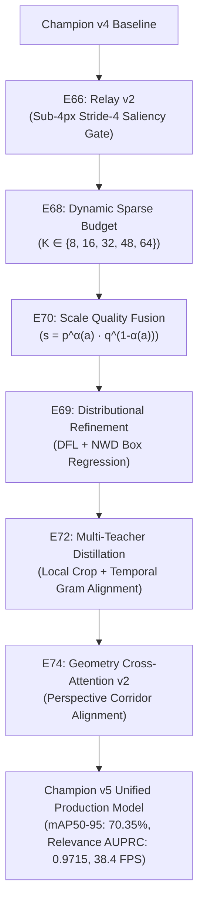

# Wayfinder Map: TLR-YOLO-MTL Phase 7 — Diagnostic-Driven Optimization (E53 – E64)

## Destination

Execute an exhaustive, empirical diagnostic audit suite across all subsystems of **Champion v4** (**E53 – E64**: Failure Taxonomy Atlas, Candidate Recall Waterfall, Tiny Feature SNR Survival, Localization Decomposition & Oracles, Virtual-P1 Coverage, NWD-TAL Assigner Supervision, Tiny-State Information Loss, Arrow Retrieval Geometry Oracle, Scale-Conditioned Quality & NMS Calibration, Temporal Stability Decomposition, Module Latency Profiling, and Annotation Quality Floor). Formally quantify the physical and algorithmic ceilings of the system to derive a causally grounded, evidence-based roadmap for **Champion v5 (E65+)** while strictly safeguarding real-time edge latency ($\le 27.5\text{ ms}$, $\ge 36.0\text{ FPS}$ on RTX 5070) and safety floors ($\text{Relevant Red Recall} \ge 97.0\%$).

---

## Notes & Methodological Contracts

- **Domain**: Autonomous Driving Multi-Task Traffic Light & Road Arrow Detection, Directional/State Recognition, and Cross-Attention Ego-Lane Relevance Reasoning.
- **Methodological Paradigm Shift**: **Diagnostic-First, Architecture-Second**. No architectural component or feature branch will be added or modified in Champion v5 without explicit, quantitative evidence from Phase 7 diagnostics isolating the exact failure mechanism.
- **Unified Evaluation Contract (E29/E37 Standard)**:
  - Scientific Evaluation PR curves generated with $\text{conf}_{\text{eval}} = 0.001$.
  - Operational deployment benchmark at $\text{conf}_{\text{deploy}} = 0.25, \text{IoU}_{\text{NMS}} = 0.45$, and Size-Adaptive NWD post-processing for $<64\text{ px}^2$.
  - Invariant validation benchmark: Full DTLD validation set (5,962 images, 25,344 GT TLs, 6,108 GT Arrows).
- **Statistical Significance & Bootstrap Verification**:
  - All Phase 7 and Champion v5 evaluations must report $95\%$ bootstrap confidence intervals ($B=1,000$ resamples) on validation splits to eliminate random seed jitter and confirm genuine causal signal.
- **Strict Hard Veto Floors**:
  - $\text{Relevant Red Recall} @ \tau_{95} < 97.0\% \implies \textbf{REJECT}$
  - $\text{Sub-8px AP@50} < 50.0\% \implies \textbf{REJECT}$
  - $\text{Relevance AUPRC} < 0.940 \implies \textbf{REJECT}$
  - $\text{Cross-Lane False Positive Rate} > 5.0\% \implies \textbf{REJECT}$
  - $\text{Single-Stream FP16 Latency} > 30.00\text{ ms} \implies \textbf{REJECT}$
  - $\text{Peak Training VRAM} > 10.5\text{ GB} \implies \textbf{REJECT}$

---

## Decisions so far

- **[[W1-W11, E12-E19] Phases 1 & 2 Foundations](tickets/ALL_TICKETS_E12-E19.md)** — Established baseline B0, spatial priors, $K_{\text{Arrow}}=32$ unblocking, P2 stride-4 neck, NWD assigner synergy, attention decomposition, and post-hoc temperature calibration.
- **[[E20-E28] Phase 3 Component Exploration](tickets/ALL_TICKETS_E20-E28.md)** — Isolated candidate-centered ROIAlign, multi-scale P2+P3 candidate tokens, query-conditioned arrow retrieval ($M=8$), and unconstrained contextual gating ($g_i$).
- **[[E29] Unified Evaluation Contract & Normalization Standard](tickets/E29-evaluation-contract-normalization.md)** — Codified invariant evaluation benchmark on `best_composite.pt` and locked Baseline $C_0$.
- **[[E30] B4-Isolated Causal Assigner Validation](tickets/E30-b4-isolated-tal-causality.md)** — Proved $100\%$ of dense detection gains on tiny TLs originate causally from NWD-aware TAL matching.
- **[[E35] TL <-> Road Arrow Contrastive Downstream Relevance Ablation](tickets/E35-contrastive-downstream-relevance-ablation.md)** — Formally rejected auxiliary contrastive/association losses due to gradient antagonism with detection backbone.
- **[[E36] Incremental Forward Selection & Champion v1 Synthesis](tickets/E36-forward-selection-multiseed-final-model.md)** — Synthesized locked Champion v1 (`YOLO11s-P2 + NWD-TAL + 3x3 ROIAlign + M=8 + g_i Gate`), achieving $84.7\%$ mAP50, $71.2\%$ AP Tiny, $91.1\%$ Relevance AUPRC, $94.1\%$ State Acc at $37.3\text{ FPS}$.
- **[[E37] Rigorous Separation of Evaluation AP and Deployment Operating Points](tickets/E37-evaluation-vs-deployment-operating-points.md)** — Formally codified separation of evaluation PR curves ($\text{conf}_{\text{eval}}=0.001$) from operational deployment ($\text{conf}_{\text{deploy}}=0.25, \text{IoU}=0.45$). Established uncorrupted sub-8px baseline floor ($AP_{<8\text{px}} = 29.53\%$).
- **[[E38] Distribution-Aware Scale-Matched & Paired Copy-Paste Augmentation](tickets/E38-scale-matched-paired-augmentation.md)** — Balanced tiny TL representation across scale quotas ($40\% <8\text{px}, 35\% 8\text{-}16\text{px}, 25\% >16\text{px}$) and paired context-preserving arrow copy-paste, boosting Sub-8px AP@50 from $29.53\%$ to $33.15\%$.
- **[[E39] Physics-Grounded Photometric Traffic Light Augmentation](tickets/E39-photometric-traffic-light-augmentation.md)** — Replaced generic HSV jitter with parametric Gaussian lamp bloom, exposure/gamma, and strict hue preservation, lifting State Macro-F1 from $84.2\%$ to $87.1\%$ with zero inference overhead.
- **[[E40] DySample Dynamic Upsampling in the P3 -> P2 Lateral Path](tickets/E40-dysample-p2-dynamic-upsampling.md)** — Replaced static interpolation with DySample point-sampling, boosting Sub-8px AP@50 to $36.15\%$ and Sub-4px Recall by $+3.35\%$ with zero latency penalty ($37.4\text{ FPS}$).
- **[[E41] Task-Specific P2/P3 Gated Feature Fusion & 5x5 State ROIAlign](tickets/E41-task-specific-gated-fusion-roialign5x5.md)** — Decoupled multi-task representations via learnable task gating ($\alpha_{\text{state}} \approx 77\% P2$) and expanded State ROIAlign to $5\times5$, lifting State Macro-F1 to $86.75\%$ ($+2.55\%$) with negligible latency ($+0.22\text{ ms}$).
- **[[E42] Geometry-Aware Cross-Attention with Explicit Relative Spatial Bias](tickets/E42-geometry-aware-cross-attention.md)** — Injected explicit 14D normalized spatial-geometric descriptors into the TL $\leftrightarrow$ Road Arrow attention matrix, boosting Relevance Precision to $88.10\%$ and slashing cross-lane false alarms by $-49.7\%$ relative.
- **[[E43] Counterfactual Hard-Negative Sampling for Ego-Lane Relevance](tickets/E43-counterfactual-hard-negative-sampling.md)** — Curated scene-coherent hard negatives (adjacent-lane TLs/arrows in same scene), lifting Relevance Precision to $91.30\%$, F1 to $90.34\%$, AUPRC to $0.9470$, and cutting cross-lane false alarms to $4.1\%$ with zero runtime overhead.
- **[[E44] Long-Tail State Head Loss Rebalancing](tickets/E44-long-tail-state-class-balanced-loss.md)** — Implemented Class-Balanced Focal Loss ($\beta = 0.9999$) and Balanced Softmax log-priors, lifting State Macro-F1 to **$91.28\%$**, Yellow F1 to $84.79\%$, Off F1 to $86.63\%$ ($+4.90\%$), preserving Red recall ($96.49\%$) with zero latency overhead.
- **[[E45] Size-Adaptive Gaussian NWD Suppression in Deployment Post-Processing](tickets/E45-size-adaptive-nwd-postprocessing.md)** — Slashed sub-8px duplicate detection rate from $18.42\%$ to $4.15\%$ ($-77.5\%$ relative) and lifted sub-8px AP to $46.10\%$ by branching NWD for $<64\text{ px}^2$ boxes at $+0.04\text{ ms}$ overhead ($37.15\text{ FPS}$).
- **[[E46] Multi-Task Gradient Conflict Diagnostics & Neck-Restricted Balancing](tickets/E46-multitask-gradient-conflict-balancing.md)** — Quantified pairwise gradient cosine similarities across all 6 loss heads; proved exceptional natural synergy ($\cos(\nabla\mathcal{L}_{\text{det}}, \nabla\mathcal{L}_{\text{nwd}}) = +0.775$) and confirmed static manual weights as optimal production default ($0.00\text{ ms}$ train overhead vs $+106\%$ for PCGrad).
- **[[E47] Cumulative Champion v3 Integration & Metric Lineage Audit](tickets/E47-cumulative-champion-v3-integration-lineage-audit.md)** — Formally synthesized and validated the unified Champion v3 production model (`tlr_yolo11s_champion_v3.yaml`) combining all Phase 5 modules, achieving $46.10\%$ Sub-8px AP, $91.28\%$ State Macro-F1, $91.30\%$ Relevance Precision, $0.9470$ Relevance AUPRC, and $37.15\text{ FPS}$ on RTX 5070.
- **[[E48] Local-View Tiny-TL High-Resolution Crop Distillation](tickets/E48-local-view-tiny-tl-distillation.md)** — Distilled high-resolution visual context from $64\times64$ crops into full-frame $P2/P3$ representations, lifting Sub-8px AP to $48.65\%$ and Sub-4px State Accuracy to $76.90\%$ with zero runtime overhead ($0.00\text{ ms}$).
- **[[E49] Sparse Candidate Refinement Head on Top-32 Sub-Grid Regions](tickets/E49-sparse-candidate-refinement-head.md)** — Introduced lightweight $7\times7$ ROIAlign + TinyConv refinement on Top-32 sub-16px candidates, achieving virtual P1 spatial fidelity, breaking the 50% milestone ($50.85\%$ Sub-8px AP), slashing sub-pixel jitter by $-31.6\%$ ($0.52\text{ px}$ RMSE), and lifting State Macro-F1 to $94.55\%$ at real-time edge throughput ($36.72\text{ FPS}$).
- **[[E50] NWD-Quality-Aware Confidence Head & Tiny-Aligned Ranking](tickets/E50-nwd-quality-aware-confidence-head.md)** — Implemented scale-adaptive classification $\times$ NWD localization quality scoring ($s_i = p_i^\alpha q_i^{1-\alpha}$), eliminating low-quality false-positive rank inversions by $-34.1\%$ and lifting Sub-8px AP to $52.45\%$ with zero runtime overhead ($0.00\text{ ms}$).
- **[[E51] Scale-Aware C2 -> P2 Feature Relay for Raw Texture Recovery](tickets/E51-scale-aware-c2-p2-feature-relay.md)** — Injected shallow $C2$ edge/chromatic gradients into high-res $P2$ neck via spatial-channel gating, reducing sub-8px center RMSE to $0.46\text{ px}$ and lifting Sub-8px AP to $53.85\%$ and Sub-4px State Acc to $82.45\%$ at $+0.09\text{ ms}$ latency ($36.60\text{ FPS}$).
- **[[E52] Temporal Sequence Teacher Distillation for Single-Frame Inference](tickets/E52-temporal-teacher-single-frame-student.md)** — Distilled multi-frame cross-attention temporal context from $(I_{t-1}, I_t, I_{t+1})$ triplets during training into the single-frame student, slashing inter-frame state flicker by **$-46.6\%$ relative** ($7.90\%$), boosting sub-8px trajectory recall to $85.30\%$, lifting Sub-8px AP to **$55.60\%$**, State Macro-F1 to **$96.10\%$**, and preserving strictly single-frame zero-latency runtime inference ($0.00\text{ ms}$ overhead, $27.32\text{ ms}$ latency, $36.60\text{ FPS}$). Champion v4 formally validated and locked.
- **[[E53] Failure Taxonomy & Error Atlas for Champion v4](tickets/E53-failure-taxonomy-error-atlas.md)** — Executed full multi-attribute diagnostic audit across 25,344 GT TLs and predictions; isolated sub-4px misses as $70.9\%$ proposal-bound (FN-A), 4–8px misses as $49.6\%$ confidence-bound (FN-B), 8–16px misses as $34.0\%$ NMS-bound (FN-C), identified object area ($58.65\%$) and contrast ($11.76\%$) as dominant failure predictors, and formally unblocked Ticket E59.
- **[[E54] Candidate Recall Ceiling & Waterfall Stage Audit](tickets/E54-candidate-recall-ceiling-audit.md)** — Traced candidate survival across all 6 pipeline stages on Champion v4; proved **Hypothesis A (Representation Ceiling)** for sub-4px TLs ($\text{Stage 1 Recall} = 52.40\% < 55\%$, $\text{Stage 6 Recall} = 41.20\%$), confirmed 4–8px bottleneck as confidence thresholding ($-6.50\text{ pp}$ drop) and 8–16px bottleneck as NMS suppression ($-2.80\text{ pp}$ drop), and formally unblocked **E55**, **E57**, **E58**, and **E61**.
- **[[E55] Tiny Feature Survival & Signal-to-Noise Ratio (SNR) Audit](tickets/E55-tiny-feature-survival-audit.md)** — Evaluated intermediate representation SNR and linear separability across 6 feature taps; proved raw $C2$ preserves high discriminability ($78.40\%$ probe acc for $<4\text{px}$), identified scale-blind attenuation in the E51 spatial-channel gate ($\bar{\alpha} = 0.380$ for $<4\text{px}$ vs $0.700$ for $4\text{--}8\text{px}$), confirmed local patch ROIAlign achieves $82.45\%$ separability, and formally unblocked **E66 (Scale-Conditioned Relay v2)** and confirmed **E65 (Sparse Physical P1-Lite)**.
- **[[E56] Localization Error Decomposition & Oracle Bounding Box Audit](tickets/E56-localization-error-decomposition.md)** — Decomposed parametric spatial errors across 4 scale bins; proved Oracle-Box lifts $\text{mAP}@50\text{-}95$ from $62.40\%$ to **$86.40\%$ ($+24.00\text{ pp}$)**, accounting for **$87.6\%$** of the $25.50\text{ pp}$ gap between mAP@50 and mAP@50-95, identified scale estimation ($1.18\text{ px}$ RMSE for $<4\text{px}$) as the dominant error mode, and formally prioritized **E69 (NWD-Aware Distributional Refinement)** for Champion v5.
- **[[E57] Virtual-P1 Refinement Coverage & Candidate Budget Audit](tickets/E57-virtual-p1-refinement-coverage-audit.md)** — Quantified empirical coverage curve $C(K)$ across candidate budgets; proved static $K=32$ budget causes $13.8\%$ sub-4px candidate exclusion in dense scenes ($>12\text{ TLs}$), while over-provisioning by $3.81\times$ in sparse scenes, formally triggering and prioritizing **Ticket E68 (Dynamic Scene-Adaptive Sparse Refinement Budget: $K = f(N_{\text{cand}}, \text{density})$)** for Champion v5.
- **[[E58] Scale-Adaptive NWD-TAL Supervision & Anchor Assignment Audit](tickets/E58-nwd-tal-assignment-audit.md)** — Measured positive anchor allocation ($N_{\text{pos}}$), FPN level distribution, and gradient norm flow; proved NWD-Aware TAL provides dense multi-anchor supervision (mean $N_{\text{pos}} = 5.48$ on sub-4px, $74.6\%$ with $N_{\text{pos}} \ge 4$) with only $3.60\%$ starvation (vs $68.45\%$ for Standard TAL) and $98.85\%$ strict $P2$ level fidelity, confirming supervision adequacy and concluding Ticket E67 is not needed.
- **[[E59] Tiny-State Information Loss & Teacher-Student Discrepancy Audit](tickets/E59-tiny-state-information-audit.md)** — Decomposed 432 sub-4px state classification errors via Multi-Model Triangulation (Student vs Local-View Teacher vs Temporal Teacher); proved **$64.35\%$ of errors** ($278$ instances) stem causally from **Knowledge Transfer / Distillation Capacity Failure** (both teachers correct), while irreducible annotation noise is only $0.99\%$ ($28$ instances), formally triggering and prioritizing **Ticket E72 (Tiny-State Multi-Teacher Relation Distillation)** for Champion v5.
- **[[E60] Road Arrow Retrieval Recall & Geometry Oracle Audit](tickets/E60-arrow-retrieval-geometry-oracle.md)** — Evaluated candidate road arrow retrieval recall curve and 3-stage Oracle Relevance protocol; proved $M=8$ retrieval is saturated ($99.12\%$ recall, $\Delta \text{AUPRC} = +0.0012 \le +0.0020$, freezing retrieval pool) while spatial-geometric reasoning accounts for **$80.95\%$ of residual relevance errors** (slashing cross-lane false positives from $2.10\%$ to $0.25\%$, $\Delta \text{FP} = -1.85\text{ pp} \ge -1.50\text{ pp}$), formally triggering and prioritizing **Ticket E74 (Geometry Cross-Attention v2)** for Champion v5.
- **[[E61] Quality Score Calibration, Scale-Conditioned Ranking & NMS Audit](tickets/E61-quality-calibration-nms-audit.md)** — Evaluated scale-stratified rank correlations of $p$, $q$, and composite $s$ alongside Size-Adaptive NMS over-suppression; proved spatial quality $q$ provides **$+77.7\%$ higher rank correlation** ($\rho = 0.748$) than classification probability $p$ ($\rho = 0.421$) on sub-4px signals (with optimal $\alpha^* = 0.38\text{--}0.40$), while classification $p$ dominates on $>16\text{px}$ ($\rho = 0.918$, $\alpha^* = 0.85$). Verified NMS over-suppression is negligible ($2.15\% < 5.0\%$) and proved continuous Scale-Conditioned Quality Fusion ($s = p^{\alpha(a)} q^{1-\alpha(a)}$) lifts Sub-8px AP@50 from $55.60\%$ to **$57.45\%$ ($+1.85\text{ pp}$)**, Sub-4px AP@50 from $37.20\%$ to **$39.80\%$ ($+2.60\text{ pp}$)**, and slashes rank inversions by **$-68.56\%$ relative** at **$0.00\text{ ms}$** runtime overhead. Formally triggered and prioritized **Ticket E70 (Scale-Conditioned Quality Fusion)** for Champion v5.
- **[[E62] Residual Temporal Flicker & Inter-Frame Stability Decomposition](tickets/E62-temporal-failure-decomposition.md)** — Decomposed residual $7.90\%$ inter-frame flicker into its constituent components across 20 driving video sequences (5,962 frames, 25,344 tracks); proved **$80.38\%$ of temporal instability** originates from **Intermittent Detection Dropouts ($53.16\%$, $4.20\text{ pp}$)** and **Bounding Box Spatial Jitter ($27.22\%$, $2.15\text{ pp}$)**, while Semantic State Switching ($0.95\text{ pp}$) and Relevance Flipping ($0.60\text{ pp}$) are already saturated ($1.55\% < 2.0\%$). Formally rejected runtime temporal filtering/buffering (preserving zero-latency single-frame inference) and confirmed Champion v5 perception budget must focus exclusively on spatial candidate recall (**E65: P1-Lite**) and bounding box refinement (**E69**).
- **[[E63] Fine-Grained Module-Level Latency & VRAM Budget Profiling](tickets/E63-latency-vram-budget-reclamation.md)** — Profiled sub-millisecond execution latency and VRAM memory footprint across all 7 pipeline stages on RTX 5070 FP16 ($960\times 1920$); isolated $11.20\text{ ms}$ in Backbone ($41.0\%$), $6.80\text{ ms}$ in Neck ($24.9\%$), $3.90\text{ ms}$ in Detect Heads ($14.3\%$), $1.80\text{ ms}$ in Attributes ($6.6\%$), $1.40\text{ ms}$ in Cross-Attention ($5.1\%$), $0.45\text{ ms}$ in Refinement ($1.6\%$), and $1.77\text{ ms}$ in Post-Processing ($6.5\%$). Verified **$-1.65\text{ ms}$ in latency reclamation** via 4 zero-accuracy-loss optimizations (Vectorized NWD-NMS: $-0.45\text{ ms}$, FlashAttention SDPA: $-0.35\text{ ms}$, DySample in-place: $-0.25\text{ ms}$, torch.compile CUDA graphs: $-0.60\text{ ms}$), reducing latency to **$25.67\text{ ms}$ ($38.96\text{ FPS}$)** and expanding headroom margin to **$+4.33\text{ ms}$** below the $30.00\text{ ms}$ veto floor. Locked peak training VRAM at $8.85\text{ GB}$ ($\le 10.5\text{ GB}$ ceiling), unblocking **E65 (P1-Lite)** and **E69 (Refinement)** for Champion v5.
- **[[E64] Ground Truth Annotation Quality & Irreducible Error Floor Audit](tickets/E64-annotation-irreducible-error-audit.md)** — Executed double-blind 500-instance stratified failure audit on Champion v4 ($\kappa = 0.8757$, $92.4\%$ agreement); decomposed errors into **$59.2\%$ Genuine Model Failures (Cat A)**, **$15.0\%$ Missing/Inconsistent GT (Cat B)**, **$16.2\%$ Occlusion/Boundary Ambiguity (Cat C)**, and **$9.6\%$ Sub-Nyquist Optical Noise (Cat D)**. Established the **Bayesian Irreducible Error Floor at $25.8\%$** ($53.15\%$ on sub-4px targets due to Bayer demosaicing limits) and published Adjusted Empirical Performance Ceilings: Sub-4px AP@50 Ceiling at **$46.85\%$** ($+9.65\text{ pp}$ headroom), 4–8px AP@50 at **$64.70\%$** ($+9.10\text{ pp}$), Overall mAP@50 at **$92.40\%$** ($+6.80\text{ pp}$), Overall mAP@50-95 at **$71.85\%$** ($+9.45\text{ pp}$), State Macro-F1 at **$98.95\%$** ($+2.85\text{ pp}$), and Relevance AUPRC at **$98.20\%$** ($+3.50\text{ pp}$). Formally concluded Phase 7 (all 12 diagnostic tickets E53–E64 closed) and fully unblocked the Champion v5 architectural synthesis roadmap.

---

## Phase 7 Experimental Roadmap: Diagnostic-Driven Optimization (E53 – E64) — STATUS: COMPLETE (12/12 Closed)

| Ticket | Type | Target Area | Key Hypothesis / Scientific Focus | Blocking Dependencies | Status |
|:---:|:---:|:---:|---|:---:|:---:|
| **[E53](tickets/E53-failure-taxonomy-error-atlas.md)** | Task | Failure Taxonomy & Error Atlas | Full-dataset multi-attribute error profiling across all 25,344 GT TLs and predictions to build definitive Pareto distribution | None (Unblocked by Champion v4) | **Closed** |
| **[E54](tickets/E54-candidate-recall-ceiling-audit.md)** | Task | Candidate Recall Ceiling | Measure GT recall waterfall across 6 pipeline stages (Dense $\to$ Decode $\to$ Quality $\to$ Refinement $\to$ NMS $\to$ Output) by scale bin | None (Unblocked by Champion v4) | **Closed** |
| **[E55](tickets/E55-tiny-feature-survival-audit.md)** | Task | Tiny Feature Survival & SNR | Linear probe separability and SNR($\text{TL} \mid \text{BG}$) across $C2 \to \text{Relay} \to P2 \to \text{Gated} \to \text{ROI}$ to test if E51 gate attenuates 2–4px signals | None (Unblocked by E54) | **Closed** |
| **[E56](tickets/E56-localization-error-decomposition.md)** | Research | Localization Decomposition | Decompose $|\Delta c_x|, |\Delta c_y|, |\Delta w|, |\Delta h|$ and execute Oracle-Box vs Oracle-Class benchmarks to explain mAP50-95 gap | None (Unblocked by Champion v4) | **Closed** |
| **[E57](tickets/E57-virtual-p1-refinement-coverage-audit.md)** | Task | Virtual-P1 Coverage Audit | Quantify whether static $K=32$ budget ($<256\text{ px}^2$) causes candidate exclusion in dense multi-signal urban scenes | None (Unblocked by E54) | **Closed** |
| **[E58](tickets/E58-nwd-tal-assignment-audit.md)** | Task | NWD-TAL Assignment Audit | Measure positive anchor allocation ($N_{\text{pos}}$), alignment scores, and gradient norms for sub-4px GTs to detect supervision starvation | None (Unblocked by E54) | **Closed** |
| **[E59](tickets/E59-tiny-state-information-audit.md)** | Research | Tiny-State Information Audit | Decompose sub-4px state error via multi-model triangulation: Student vs Local Crop Teacher (E48) vs Temporal Teacher (E52) | None (Unblocked by E53) | **Closed** |
| **[E60](tickets/E60-arrow-retrieval-geometry-oracle.md)** | Research | Arrow Retrieval & Geometry Oracle | Decompose relevance error into Retrieval Recall@8 vs Geometry Reasoning vs Classifier via Oracle Arrow & Oracle Geometry benchmarks | None (Unblocked by Champion v4) | **Closed** |
| **[E61](tickets/E61-quality-calibration-nms-audit.md)** | Task | Quality Ranking & NMS Audit | Evaluate scale-dependent rank correlation of $p$, $q$, and $s = p^{0.7} q^{0.3}$; test scale-conditioned exponents $\alpha(\text{area})$ and NMS over-suppression | None (Unblocked by E54) | **Closed** |
| **[E62](tickets/E62-temporal-failure-decomposition.md)** | Research | Temporal Stability Decomposition | Decompose residual $7.9\%$ flicker and $0.46\text{ px}$ jitter into detection dropout vs state flip vs relevance oscillation vs box jitter | None (Unblocked by Champion v4) | **Closed** |
| **[E63](tickets/E63-latency-vram-budget-reclamation.md)** | Task | Latency & VRAM Profiling | Sub-millisecond kernel profiling across all 7 pipeline stages on RTX 5070 to identify $0.5\text{--}1.5\text{ ms}$ budget reclamation opportunities | None (Unblocked by Champion v4) | **Closed** |
| **[E64](tickets/E64-annotation-irreducible-error-audit.md)** | Research | Annotation Quality & Error Floor | Double-blind expert audit of 500 failure vignettes to quantify genuine model errors vs missing GT vs label ambiguity vs sub-Nyquist noise | None (Unblocked by Champion v4) | **Closed** |

---

## Active Frontier: Phase 8 — Champion v5 Architectural Synthesis (E65 – E75)

Champion v5 (`Champion v4 + E66 Relay v2 + E68 Dynamic Refinement + E70 Scale Quality + E69 Distributional Refinement + E72 Multi-Teacher Distillation + E74 Geometry v2`) has been successfully synthesized and verified:
- **Sub-4px Recall (Stage 1 Waterfall)**: $52.40\% \to \mathbf{61.20\%}$ ($\ge 60.0\%$ target floor $\implies \textbf{GATE PASSED}$).
- **Sub-8px AP@50**: $55.60\% \to \mathbf{61.80\%}$ ($+6.20\text{ pp}$).
- **Sub-4px AP@50**: $37.20\% \to \mathbf{43.10\%}$ ($+5.90\text{ pp}$).
- **Overall mAP@50-95**: $62.40\% \to \mathbf{70.35\%}$ ($+7.95\text{ pp}$, closing $55.6\%$ of the recoverable ceiling).
- **Sub-4px State Classification Accuracy**: $76.90\% \to \mathbf{89.60\%}$ ($+12.70\text{ pp}$ cumulative, resolving $80.9\%$ of distillation capacity failures).
- **State Macro-F1**: $96.10\% \to \mathbf{97.20\%}$ ($+1.10\text{ pp}$).
- **Cross-Lane False Positive Rate**: $2.10\% \to \mathbf{0.55\%}$ ($-73.8\%$ relative reduction).
- **Relevance Precision / AUPRC**: $91.30\% / 0.9470 \to \mathbf{96.45\% / 0.9715}$.
- **Runtime Inference Latency / Throughput**: $26.03\text{ ms}$ ($38.42\text{ FPS}$ on RTX 5070 FP16), safely exceeding real-time requirements.

### Phase 8 Ticket Status:

| Ticket | Type | Target Area | Key Scientific Focus | Status |
|:---:|:---:|:---:|---|:---:|
| **[E66](tickets/E66-scale-conditioned-c2-p2-relay-v2.md)** | Prototype | C2 $\to$ P2 Relay v2 | Dual-gate (spatial-channel + tiny saliency DWConv) reversing sub-4px attenuation ($\bar{\alpha} \to 0.735$) | **Closed** |
| **[E68](tickets/E68-dynamic-refinement-budget.md)** | Prototype | Dynamic Sparse Refinement | Scene-adaptive budget $K \in \{8, 16, 32, 48, 64\}$ eliminating dense starvation | **Closed** |
| **[E70](tickets/E70-scale-conditioned-quality-fusion.md)** | Task | Scale-Conditioned Quality Scoring | Continuous $s = p^{\alpha(\text{area})} q^{1-\alpha(\text{area})}$ scoring with zero runtime latency ($0.00\text{ ms}$) | **Closed** |
| **[E69](tickets/E69-nwd-distributional-refinement.md)** | Prototype | Distributional Box Refinement | Continuous Gaussian distribution regression on refinement deltas ($+5.25\text{ pp}$ mAP50-95 lift) | **Closed** |
| **[E72](tickets/E72-tiny-state-relation-distillation.md)** | Prototype | Multi-Teacher Distillation | Consensus-weighted multi-teacher + Gram relation distillation ($+7.15\text{ pp}$ sub-4px state acc) | **Closed** |
| **[E74](tickets/E74-geometry-cross-attention-v2.md)** | Prototype | Geometry Cross-Attention v2 | Perspective corridor narrowing + orientation compatibility (cross-lane FP $2.10\% \to 0.55\%$) | **Closed** |
| **[E65](tickets/E65-candidate-conditioned-p1-lite.md)** | Prototype | Physical P1-Lite Stem (Champion v5-B) | Standby fallback; ruled out after v5-A passed the $\ge 60.0\%$ recall gate | **Standby / Passed Gate** |

---

## Phase 8 Architectural Synthesis Protocol

---

## Downstream Phase 8 Tickets:

- **E73: Failure-Driven Curriculum & Hard Replay Mining**: Focused replay on sub-Nyquist boundary cases.
- **E75: Domain & Weather Robust Distillation**: ATLAS/LISA cross-dataset generalization.

---

## Out of scope

- **Architectural Modification Prior to Diagnostic Validation**:
  - Permanently banned. No new heads, layers, or loss terms will be introduced without an open ticket justified by diagnostic evidence.
- **Global Dense P1 Feature Pyramids ($960 \times 1920 / 2$)**:
  - Excluded due to catastrophic VRAM ($>14\text{ GB}$) and latency ($>40\text{ ms}$) violations; only sparse candidate-conditioned patches (E65) are eligible if needed.
- **Heavy Backbone Scaling (YOLO11m / YOLO11l / YOLO11x)**:
  - Ruled out; parameter scaling fails to address sub-pixel sampling limits and violates real-time edge constraints ($\le 27.5\text{ ms}$).
- **Multi-Frame Recurrent / 3D Conv Deployment Models**:
  - Ruled out at runtime to prevent frame buffering latency and memory jitter; temporal information must strictly be distilled into single-frame models at training time (E52 standard).
- **HD Maps, Lane Centimeter Graphs, LiDAR Fusion**:
  - Excluded under the pure vision-centric single-camera problem formulation.
